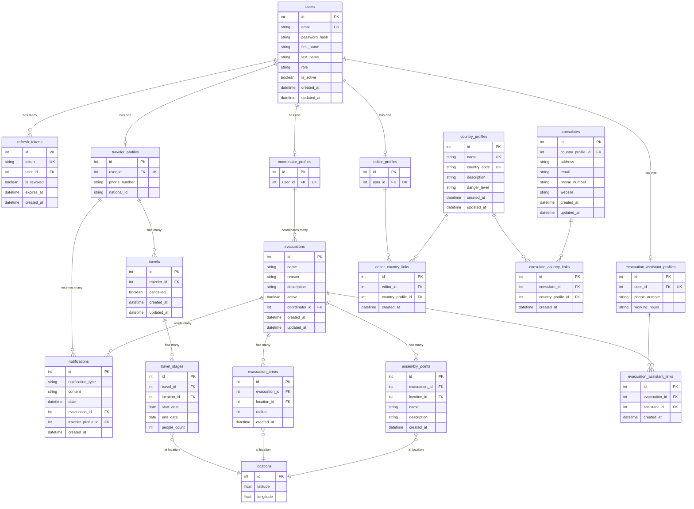

```mermaid
erDiagram
  users ||--o{ refresh_tokens : "has many"
  users ||--o| traveler_profiles : "has one"
  users ||--o| editor_profiles : "has one"
  users ||--o| coordinator_profiles : "has one"
  users ||--o| evacuation_assistant_profiles : "has one"
  
  traveler_profiles ||--o{ travels : "has many"
  traveler_profiles ||--o{ notifications : "receives many"
  
  travels ||--o{ travel_stages : "has many"
  travel_stages }o--|| locations : "at location"
  
  coordinator_profiles ||--o{ evacuations : "coordinates many"
  
  evacuations ||--o{ evacuation_areas : "has many"
  evacuations ||--o{ assembly_points : "has many"
  evacuations ||--o{ notifications : "sends many"
  
  evacuation_areas }o--|| locations : "at location"
  assembly_points }o--|| locations : "at location"
  
  evacuation_assistant_profiles ||--o{ evacuation_assistant_links : ""
  evacuations ||--o{ evacuation_assistant_links : ""
  
  editor_profiles ||--o{ editor_country_links : ""
  country_profiles ||--o{ editor_country_links : ""
  
  country_profiles ||--o{ consulate_country_links : ""
  consulates ||--o{ consulate_country_links : ""
  
  users {
    int id PK
    string email UK
    string password_hash
    string first_name
    string last_name
    string role
    boolean is_active
    datetime created_at
    datetime updated_at
  }
  
  refresh_tokens {
    int id PK
    string token UK
    int user_id FK
    boolean is_revoked
    datetime expires_at
    datetime created_at
  }
  
  traveler_profiles {
    int id PK
    int user_id FK "UK"
    string phone_number
    string national_id
  }
  
  editor_profiles {
    int id PK
    int user_id FK "UK"
  }
  
  coordinator_profiles {
    int id PK
    int user_id FK "UK"
  }
  
  evacuation_assistant_profiles {
    int id PK
    int user_id FK "UK"
    string phone_number
    string working_hours
  }
  
  travels {
    int id PK
    int traveler_id FK
    boolean cancelled
    datetime created_at
    datetime updated_at
  }
  
  travel_stages {
    int id PK
    int travel_id FK
    int location_id FK
    date start_date
    date end_date
    int people_count
  }
  
  locations {
    int id PK
    float latitude
    float longitude
  }
  
  evacuations {
    int id PK
    string name
    string reason
    string description
    boolean active
    int coordinator_id FK
    datetime created_at
    datetime updated_at
  }
  
  evacuation_areas {
    int id PK
    int evacuation_id FK
    int location_id FK
    int radius
    datetime created_at
  }
  
  assembly_points {
    int id PK
    int evacuation_id FK
    int location_id FK
    string name
    string description
    datetime created_at
  }
  
  notifications {
    int id PK
    string notification_type
    string content
    datetime date
    int evacuation_id FK
    int traveler_profile_id FK
    datetime created_at
  }
  
  country_profiles {
    int id PK
    string name UK
    string country_code UK
    string description
    string danger_level
    datetime created_at
    datetime updated_at
  }
  
  consulates {
    int id PK
    int country_profile_id FK
    string address
    string email
    string phone_number
    string website
    datetime created_at
    datetime updated_at
  }
  
  editor_country_links {
    int id PK
    int editor_id FK
    int country_profile_id FK
    datetime created_at
  }
  
  consulate_country_links {
    int id PK
    int consulate_id FK
    int country_profile_id FK
    datetime created_at
  }
  
  evacuation_assistant_links {
    int id PK
    int evacuation_id FK
    int assistant_id FK
    datetime created_at
  }
```
